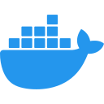

<h1 align="center">Hi, I'm To Duc!</h1>

  
  
  
  

I do SWE things 🙄

<h2>⚡️ A Few Quick Facts</h2>

<ul>
  <li>
    🔭 I’m currently working on
    <a href="https://github.com/20toduc01/chess-nest">chess-nest</a>.
  </li>
  <li>
    🧐 Learning about <strong>optimization</strong> and
    <strong>distributed systems</strong>.
  </li>
  <li>
    👨‍💻 Most of my projects are available on
    <a href="https://github.com/tokudayo">Github</a>.
  </li>
  <li>
    📝 I <del>regulary</del> write articles on
    <a href="https://tokudayo.github.io">my blog</a>.
  </li>
  <li>
    💬 Ping me about
    <strong>ML, chess, competitive programming, and cloud stuff</strong>.
  </li>
  <!-- <li>📙 Check out my <a href="">resume</a>.</li> -->
</ul>

<h2 align="left" id="macropower-tech">Favorite Tech</h2>

> Tools, languages, and other things that I like to work with.

<table>
  <tr>
    <td align="center" width="96">
      
       Node
    </td>
    <td align="center" width="96">
      
       Python
    </td>
    <td align="center" width="96">
      
       TypeScript
    </td>
    <td align="center" width="96">
      
       NestJS
    </td>
    <td align="center" width="96">
      
       AWS
    </td>
    <td align="center" width="96">
      
       Redis
    </td>
    <td align="center" width="96">
      
       Docker
    </td>
    <td align="center" width="96">
      
       Debian
    </td>
  </tr>
</table>

<!--

-->
